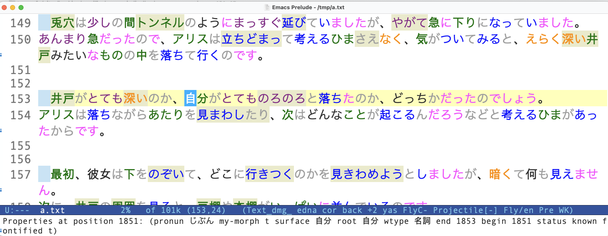

* Yomikun — Japanese Reading Assistant for Emacs
:PROPERTIES:
:CREATED:  2025-01-03 23:18:14
:END:

Yomikun brings yomichan/migaku-style features to Emacs for learning Japanese.

- Tokenize Japanese text using mecab (supports UniDic and IPAdic dictionaries)
- Color-code words by grammatical type (nouns, verbs, particles, etc.)
- Track learning status of words: known, unknown, learning, ignored
- Look up definitions via tooltip (using [[https://github.com/melissaboiko/myougiden][myougiden]])
- Look up kanji information (using [[https://github.com/neocl/jamdict][jamdict]])
- Detect compound terms
- Jump to reference sites ([[https://jisho.org][jisho.org]], [[http://kanjidamage.com][kanjidamage.com]])

See a demo [[https://youtu.be/vOsyCawWjRc][here]].

* Quick Start

1. Install the requirements (see below)
2. Add to your Emacs config:

#+begin_src emacs-lisp
(use-package emacsql :straight t)
(use-package pos-tip :straight t)
(use-package yomikun
  :straight nil
  :load-path "~/.emacs.d/modules/yomikun"
  :config
  (setq yk-mecab-binary "/opt/homebrew/bin/mecab")   ;; or your mecab path
  (setq yk-mecab-dict-dir nil)                        ;; nil = use default dictionary
  (setq yk-mecab-dict-type 'ipadic)                   ;; or 'unidic
  (setq yk-db-status-file "~/jp-status.db")
  (setq yk-db-dict-file "~/dictionary.db"))
#+end_src

3. Open a Japanese text file
4. =M-x yk-minor-mode= — parses the buffer and activates keybindings

* Requirements

** Mecab

Yomikun uses [[https://taku910.github.io/mecab/][mecab]] for morphological analysis. Two dictionary formats are supported:

*** IPAdic (easiest)

#+begin_src bash
brew install mecab mecab-ipadic
#+end_src

Then set:
#+begin_src emacs-lisp
(setq yk-mecab-binary "mecab")
(setq yk-mecab-dict-type 'ipadic)
#+end_src

*** UniDic (more detailed tokenization)

Download from [[https://github.com/CrescentKohana/MecabUnidic/releases/tag/v1.2.1][MecabUnidic releases]]. You need the homebrew mecab binary with the UniDic dictionary files:

#+begin_src emacs-lisp
(setq yk-mecab-binary "/opt/homebrew/bin/mecab")
(setq yk-mecab-dict-dir "/path/to/MecabUnidic/support")
(setq yk-mecab-dict-type 'unidic)
#+end_src

*** Verifying your setup

Run =M-x yk-doctor= to check that mecab, the dictionary, and the databases are all configured correctly.

** Myougiden (dictionary lookups)

#+begin_src bash
pip install myougiden
#+end_src

After installation, download the dictionary database as described on the [[https://github.com/melissaboiko/myougiden][myougiden]] page.

Verify:
#+begin_src bash
myougiden --human お願い
#+end_src

** Jamdict (kanji information)

#+begin_src bash
pip install jamdict jamdict-data
#+end_src

After installation, verify the database location:

#+begin_src bash
python3 -m jamdict info
#+end_src

Look for the =Jamdict DB location= line. If it says =[OK]=, you're set.

If =JAMDICT_HOME= shows =[Missing]=, create the directory and config:

#+begin_src bash
python3 -m jamdict config
#+end_src

The =kanji-dict.py= script (in [[./other/kanji/]]) needs the database path. If jamdict installed the DB in a non-standard location (common with pip =--user= installs), edit the path in =kanji-dict.py= or set:

#+begin_src emacs-lisp
(setq yk-kanji-dict-command '("/path/to/kanji-dict.py"))
#+end_src

Verify it works:
#+begin_src bash
kanji-dict.py 日本
#+end_src

Expected output: stroke count, grade, frequency, readings for each kanji.

** Emacs packages

- =emacsql= and =emacsql-sqlite= — SQLite database access ([[https://github.com/magit/emacsql][emacsql]])
- =pos-tip= — tooltip display near point

Both are available from MELPA.

** Status database

Copy one of the JLPT word lists from [[./db/]] as your starting database:

#+begin_src bash
cp db/tangoN5.db ~/jp-status.db
#+end_src

Or create an empty database with =M-x yk-db-status-create=.

** Dictionary database

Decompress the quick-lookup dictionary:

#+begin_src bash
bunzip2 -k db/dictionary.db.bz2
cp db/dictionary.db ~/dictionary.db
#+end_src

This database provides fast definitions for the cursor-sensor auto-help feature.

* Usage

** Basic workflow

1. Open a Japanese text file
2. =M-x yk-minor-mode= — automatically parses the buffer, finds compounds, and activates keybindings
3. Navigate the text — unknown words are highlighted with a colored background
4. Mark words as you learn them using the keybindings below
5. Press =RET= on any word to see its dictionary definition

If the buffer has already been parsed, =yk-minor-mode= skips parsing and just activates the keybindings.

** Processing commands

| Command         | Description                                     |
|-----------------+-------------------------------------------------|
| =yk-minor-mode= | Activate yomikun (auto-parses if needed)         |
| =yk-do-buffer=   | Parse the entire buffer                          |
| =yk-do-region=   | Parse the selected region                        |
| =yk-do-all-compounds= | Find compound terms (run after parsing)    |
| =yk-verify-buffer= | Verify parsing consistency                    |
| =yk-doctor=      | Diagnose mecab/database configuration            |

** Minor mode keybindings

| Key   | Command                          | Description                        |
|-------+----------------------------------+------------------------------------|
| =k=   | =yk-mark-at-point-as-known=      | Mark word as known                 |
| =u=   | =yk-mark-at-point-as-unknown=    | Mark word as unknown               |
| =l=   | =yk-mark-at-point-as-learning=   | Mark word as learning              |
| =i=   | =yk-mark-at-point-as-ignored=    | Mark word as ignored               |
| =RET= | =yk-define-at-point=             | Show dictionary definition         |
| =n=   | =yk-kanji-at-point=             | Show kanji information             |
| =j=   | =yk-jisho-at-point=             | Look up on jisho.org               |
| =m=   | =yk-kanji-damage-at-point=      | Look up on kanjidamage.com         |
| =p=   | =yk-prop-at-point=              | Show morph properties (debug)      |
| ===   | =yk-mark-sentence-at-point=     | Select current sentence            |
| =x=   | =yk-disable-mode=               | Exit yk-minor-mode                 |

Marking a word updates its status globally — all occurrences in the buffer change color immediately.

** Color coding

Words are colored by grammatical type:

| Type     | Japanese | Color       |
|----------+----------+-------------|
| Noun     | 名詞     | String face |
| Verb     | 動詞     | Steel blue  |
| Adjective | 形容詞  | Orange      |
| Adverb   | 副詞     | Purple      |
| Particle | 助詞     | Dark grey   |
| Morpheme | 助動詞   | Magenta     |

Unknown words additionally get a pink background. Learning words get a green background. Compound terms are underlined with a red wavy line.

** Auto-help

When =cursor-sensor-mode= is active (enabled automatically by =yk-minor-mode=), moving the cursor onto an unknown word shows a quick dictionary definition in a tooltip. This uses the quick-lookup dictionary database for speed.

* Configuration

All settings are available via =M-x customize-group RET yomikun=.

| Variable                 | Default               | Description                          |
|--------------------------+-----------------------+--------------------------------------|
| =yk-mecab-binary=        | ="mecab"=              | Path to mecab executable             |
| =yk-mecab-dict-dir=      | =nil=                  | Mecab dictionary directory           |
| =yk-mecab-dict-type=     | =nil= (auto-detect)    | ='unidic= or ='ipadic=               |
| =yk-db-status-file=      | ="~/yk-status.db"=     | Path to word status database         |
| =yk-db-dict-file=        | =nil=                  | Path to quick-lookup dictionary      |
| =yk-dict-command=         | ='("myougiden" "--human")= | Dictionary lookup command        |
| =yk-kanji-dict-command=   | ='("kanji-dict.py")=   | Kanji lookup command                 |
| =yk-tooltip-timeout=     | =10=                   | Tooltip display time (seconds)       |
| =yk-max-tokens-to-process= | =10000=              | Safety limit for token processing    |
| =yk-debug=                | =nil=                  | Enable debug messages                |

* Module structure

| File              | Purpose                                            |
|-------------------+----------------------------------------------------|
| =yomikun.el=       | Core: minor mode, faces, overlays, compounds        |
| =yomikun-mecab.el= | Mecab: dictionary registry, parsing, diagnostics    |
| =yomikun-db.el=    | Database: status tracking, dictionary, memoization  |
| =yomikun-dict.el=  | Dictionary: lookups, tooltips, external commands    |

* Word status

Yomikun tracks four learning states for each word:

| Status   | Meaning                                | Visual                    |
|----------+----------------------------------------+---------------------------|
| unknown  | New word, not yet studied              | Colored background (pink) |
| learning | Currently studying                     | Colored background (green)|
| known    | Fully learned                          | Text color only           |
| ignored  | Skip (names, particles you know, etc.) | Grey background           |

Words not in the database are treated as unknown.

The status database is a SQLite file with primary key =(morph, mtype, surface)=. Pre-populated JLPT word lists (N3, N4, N5) are available in [[./db/]].

* Limitations

- Tooltip width may not perfectly match content on macOS Retina displays (pos-tip limitation)
- Processing is synchronous — large files may take a few seconds
- Compound detection requires the dictionary database
- Tested on macOS; should work on Linux

* Running tests

#+begin_src bash
emacs --batch \
  -L . -L tests \
  -L /path/to/straight/build/buttercup \
  -l buttercup -f buttercup-run-discover
#+end_src

Tests require [[https://github.com/jorgenschaefer/emacs-buttercup][Buttercup]]. Integration tests require a working mecab installation.
